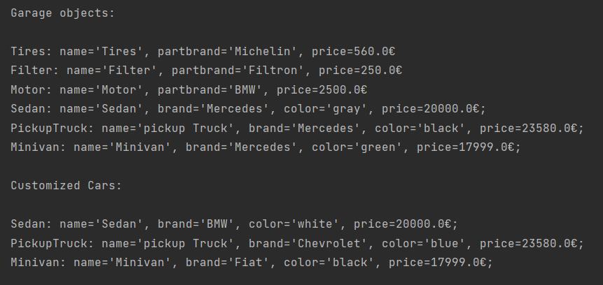
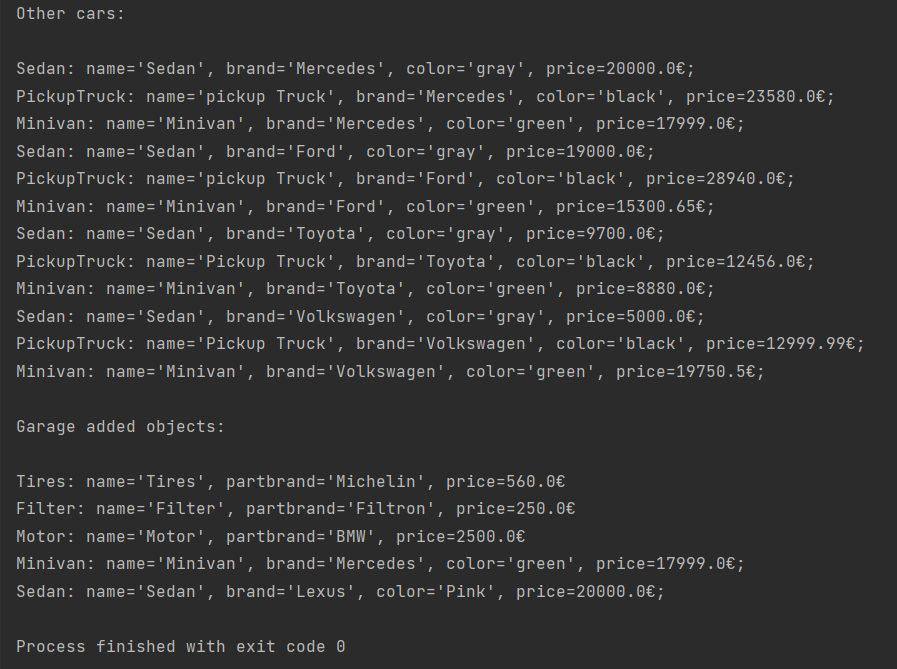

# TMPS
## Topic: Behavioral Design Patterns
#### Author: Osmătescu Antonina FAF-192
## Objectives
- Study and understand the Behavioral Design Patterns.
- As a continuation of the previous laboratory work, think about what communication between software entities might be involed in your system.
- Implement some additional functionalities using behavioral design patterns.
##Theory
**Behavioral design patterns** are concerned with the interaction and responsibility of objects.<br>
In these design patterns, the interaction between the objects should be in such a way that they can easily talk to each other and still should be loosely coupled.<br>
That means the implementation and the client should be loosely coupled in order to avoid hard coding and dependencies.<br>
Some examples from this category of design patterns are :
- Chain of Responsibility
- Command
- Interpreter
- Iterator
- Mediator
- Observer
- Strategy
## Used Design Patterns
- Iterator
## Implementation
In this laboratory work **Iterator Design Pattern** was 
used with the emphasis on the objects of type *Cars*:
*Minivan*, *PickupTruck* and *Sedan*; and objects of type
*AutoParts*:*Filter*, *Motor*, and *Tires*.
<br>The **Iterator Design Pattern** was implemented in 
*CarsIterator* class from package *Iterator*, 
allowing to iterate through objects from *Garage*.
Also, it implements interface *CarsCollection* and 
contain a collection of objects(*Cars*, *AutoParts*) 
This class return iterator through next method:
```
@Override
    public Iterator<Cars> iterator() {
        return new CarsIterator(carss);
    }
```
The iterator was later used in main class
to traverse all objects from garage in static method 
*printCarsObjects*:
```
private static void printCarsObjects(Iterator<Cars> iterator) {
        System.out.println("\nGarage added objects:\n");

        while (iterator.hasNext()) {
            Cars cars = iterator.next();
            System.out.println(cars.toString());
        }
```

## Results:
The output is represented below:

